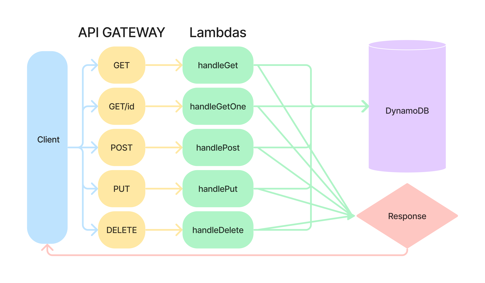

# AWS Serverless API

Functions designed to be run as AWS Lambdas, partnered with AWS API Gateway and DynamoDB.

## Author: Xavier Hillman

### Setup

Within each function folder, run `npm i dynamoose` in the terminal.

### UML



### Data and Program Flow

Root URL [Here](https://wga32p532m.execute-api.us-east-1.amazonaws.com/)

- GET `/people` requires no inputs and returns an array of objects representing items in a dynamoDB database.
- GET `/people/:id` requires the id of the item you want to get and returns a single item from the database that matches the id passed into the URL and returns the referenced item.
- POST `/people` requires a request body with the information needed to insert an item into the database and returns the new item that was added. Sample request body shown below:

```javascript
{
  "id": "<id number>",
  "FirstName": "John",
  "LastName": "Doe",
  "Phone": "123-867-5309",
}
```

- PUT `/people/:id` requires an id in the URL for the item you want to update and a request body with the information you want updated. It returns the updates item.

```javascript
  "FirstName": "JOHN",
  "Phone": "123-456-7890",
```

- DELETE `/people/:id` requires the id of the item from the database that you want to delete. A confirmation that the item was deleted is returned.
